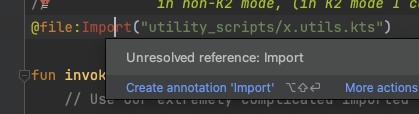
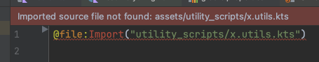

# Minimal Kotlin Scripting IDE Test Repo

Goals: Expose some IDE problems with Kotlin scripting using very simple examples that are derived from my very real codebase.

## How to confirm stuff works

Run the test at `srcs/pub/src/test/kotlin/zk/TestEverything.kt`. This can be done either via the IDE or with `./gradlew test`.

This is a very simple example and for the test to run, the script must run without errors and correctly import another script.

The IDE disagrees that this script works, however. See below.

## Troubleshooting

Sometimes, the scripts have import errors when you wouldn't expect, and they persist beyond an
"invalidate-and-restart". 

I've had luck using the following as a 'scripting reset' for the IDE:

Settings -> Languages & Frameworks -> Kotlin -> Kotlin Scripting:

Then find the script definitions in the list (these were populated because of my META-INF touchfiles. If not in the list, click the button to scan for them, then exit-and-reenter), and uncheck to disable them, apply, and then recheck to enable them, and apply... and then wait a minute or so?

I also move my annotations to the top of the list, out of fear that the high level '.kts' definition will supercede them. This is not supported by evidence though...

# Problems with Kotlin Scripting that this repo shows:

Currently, there's just one that is consistent! I have some other intermittent problems, but that's not the focus here.

## Problem: (K1 & K2) Scripts that import other scripts report the import as not being found on K1

This utilizes a feature wherein you need a script to be able to import and use another script.

My `Import` annotation is declared in `UserScriptCompilationConfiguration.kt` and this was created according to this example: https://github.com/Kotlin/kotlin-script-examples/blob/fec834e2a9a2c07c8486a684d3e131cb909015d7/jvm/simple-main-kts/simple-main-kts/src/main/kotlin/org/jetbrains/kotlin/script/examples/simpleMainKts/annotations.kt#L20

One relevant detail here is that I am using an override for where the imported scripts are relative to. A theory I have is that the IDE integration is not properly integrating with this feature.

This means the failure manifestation is not the same as that script example. As a side note, when I open that script example in my IDE and go through the troubleshooting steps listed earlier in this document, the import statement is found, but there is a false highlighting error when accessing the imported variable it seems:


### Manifestation 1: Import annotation not found

For K1: This happens when for whatever reason the IDE can't find the script definitions. I can usually move it to manifestation-2 by going through the troubleshooting tip I listed earlier by reordering and re-enabling the script definitions.

For K2: This seems to be the usual failure mode. Sometimes, I see manifestation-2 with K2, but can't consistently produce it.



Here the import annotation cannot be found by the IDE, but when the script actually runs, it is found because the function we imported is available.


### Manifestation 2: Red banner saying 'imported source file not found'

This one makes the whole file underlined in red, which is extra annoying.

Note that the path listed on the banner is actually incorrect. It should be using the path prefix that was provided to the import annotation (as this is how the script compiles and runs when you run the test!)



(This is tracked here: https://youtrack.jetbrains.com/issue/KTIJ-36841 )

# BONUS! I also show a work around for `scriptsInstancesSharing` not having the desired/intended performance.

Take a look inside of `UserScriptRegistry` to see how I use the compiled script instances.

The existing examples instead seem to run the script through the evaluators every time, which pays the class loading cost, which is huge (according to my benchmarks).

There's an 'instances sharing' configuration, which you would think would do this, but it doesn't seem to work (the performance cost is still big last time I checked).

Weird! Leaving it in the repo for an example for others to consider. Once these other problems are fixed maybe I should make an issue to track the instance sharing flag not seeming to work...


# System information from latest manual test

Last Tested: Dec 2025

Kotlin Version: 2.2.21

IDE Version:
```
IntelliJ IDEA 2025.2.5 (Community Edition)
Build #IC-252.28238.7, built on November 19, 2025
Source revision: 7059016f3609e
Runtime version: 21.0.9+10-b1038.76 aarch64 (JCEF 122.1.9)
```
